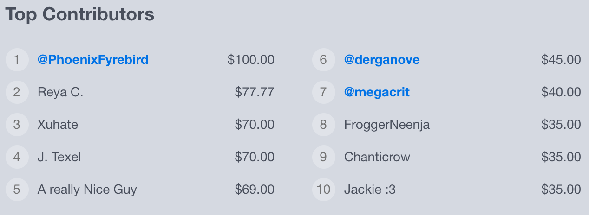

# Humble Bundle Coding Project

**After Cloud Shell starts, click the gear icon on the left to open Settings, then go to Editor Settings, and set Tab Size to 2 and check the box "Insert spaces for tabs".**

## Assignment
Humble Bundle's tech stack is built on top of a technology called Google AppEngine. For this project, we have given you a simple web application built using AppEngine. We would like you to add some features to the application we have given you.

The application we have given you implements a simple "Pay What You Want" order form. It lets customers enter their email address and how much they want to pay; and when they click submit, it writes an entry to the database containing the details of the customer's order. (The order form does not interact with real payment processors; it is just a simulator.)

For this assignment, we would like you to build a Top Contributors feature, similar to the one that exists on the [Humble Bundle website](https://www.humblebundle.com):

The Top Contributors section should show the 10 highest payments. For each payment, you should display the Name that was entered on the Order Form, as well as how much money was paid, in US dollars.

You should convert any Twitter handles in the Name to links to the Twitter website. For example, if the Name is @humble, it should be converted to a link to https://www.twitter.com/@humble. You should be able to support a Name containing multiple twitter handles; for example, if you were to enter "@bob says hi to @joe", it should separately convert @bob and @joe to Twitter links, while leaving the other words alone.

The Top Contributors section should live-update. By this, we mean that if you have the website open in two browser tabs, and you make a purchase in one of the tabs that makes it into the Top Contributors section, the other tab should be able to see it without needing to refresh.

You do not need to add any styling to the section. We will not be judging you on its appearance, other than looking to see that it is readable.

## How we will be evaluating you
At Humble Bundle, it is important for our Software Engineers to be able to learn new things. With this assignment, we are looking to see that you can learn the basics of Google AppEngine. We have included documentation in this README to explain how to do the various things you will need to do. And there are helpful comments in the code we have given you. We are also happy to answer any questions you have on how to use AppEngine; although we ask that you make an effort to figure it out yourself before asking.

Also, we expect our Software Engineers to write clean and well-architected code. In addition to verifying that your code meets the requirements of the assignment, we will also be looking to see that your code is readable and well-architected.

Finally, an important part of web development is security. We will be looking to see that your code does not contain any vulnerabilities or exploits.

## How you will be evaluating us
This project is intended to give you an example of the types of tasks you would be working at as a Software Engineer at Humble Bundle. It also exposes you to some of our core technologies. You can use this project to get a feel for whether you would like working on these types of tasks, and whether you would like using these technologies.

## Installation and getting started
1. Install Python 2.7 on your computer, if not already installed: [https://www.python.org/downloads/](https://www.python.org/downloads/)

2. Install the Google Cloud SDK on your computer: [https://cloud.google.com/sdk/docs/](https://cloud.google.com/sdk/docs/)

3. Run this command to install Google AppEngine (on Mac or Linux, you can run this from a terminal; on Windows you can use the Google Cloud SDK Shell)

        gcloud components install app-engine-python

4. Run this command in the same terminal:

        dev_appserver.py app.yaml

5. Leave the terminal open -- closing it will kill your server. Also, as you develop, there will be useful output that appears in the terminal window.

6. Navigate to [http://localhost:8080/](http://localhost:8080/) in your browser to access the application.

7. The server will automatically detect any files you change. Once you have modified a file, wait 2 or 3 seconds, and then refresh your browser to see the results of your changes.

## Files included
* **README.md**: This file

* **app.yaml**: This file contains configuration for Google AppEngine. You do not need to modify this file.

* **example.png**: This image shows how the Top Contributors section appears on the Humble Bundle website, to give you an example of what we are looking for. You do not need to match the styling of this example.

* **handlers.py**: This file contains the backend code for your application. See [Handlers](#handlers) for more info.

* **models.py**: This contains a list of the database models in your application. If you are familiar with SQL, a model is roughly equivalent to an SQL table. See [Models](#models) for more info.

* **utils.py**: This file contains Python helper functions that can be used in your handlers. Feel free to add additional functions here if you would like.

* **templates**: This directory contains your HTML files. The HTML files are actually Jinja2 templates, which allows your Python code to pass parameters to the templates. See [Jinja2 Templates](#jinja-templates) for more info.

* **assets**: This directory contains CSS, JavaScript, and image files. If you put a file in here called `blah.jpg`, you can reference it in your HTML like this:

         (CSS and JS follow the same pattern)

## Handlers
At the bottom of `handlers.py` is a list of routes. A route is a regular expression that will match the URL from the browser. The server will go through these routes one by one until it finds one that matches the URL. If multiple routes match, it will use the one that is listed first.

The second part of a route is the name of a handler class. The handler class contains the code that runs when the route is accessed. If the browser is doing a GET request, AppEngine will call a function called `get()` on the handler class. If the browser is doing a POST request, AppEngine will call a function called `post()` on the handler class. If you want a route to handle both GET and POST requests, you can include both `get()` and `post()` functions on the same handler.

A handler will generally do one or more of these things:

* Read from the database
* Write to or modify the database
* Send HTML or JSON to the browser (JSON being useful for AJAX requests)

When your handler is called from an HTML `<form>`, the form data can be retrieved in your handler using this syntax:

    data = self.request.get('name')

Where `'name'` should be changed to the name of the `<input>` in the HTML.

For more information, see the [this page for documentation](https://webapp2.readthedocs.io/en/latest/api/webapp2.html).

## Models
In AppEngine, models are how you interface with the database (called "datastore" in AppEngine). A model is roughly equivalent to an SQL table. The properties in the model are analogous to the columns of a table, except you can add or remove properties at any time without needing to modify a "schema". To add a new property, all you need to do is add a new variable to the class in `models.py`. AppEngine supports different types of properties; [click here for a list](https://cloud.google.com/appengine/docs/standard/python/datastore/typesandpropertyclasses).

## Writing to the database
To create a new entity in the database (analogous to a "row" in SQL), you create a new instance of the class, set the properties to your preferred values, and then call the `put()` function on the instance, which is what actually writes the entity to the database. If you later make modifications to the properties, you will need to call `put()` again for the modifications to be saved. Here is an example that creates a new entity for the Order model and writes it to the database:

    order = Order()
    order.name = 'Bob'
    order.email = 'bob@gmail.com'
    order.pennies_paid = 100
    order.put()

## Reading from the database

To read from the database, you will need to run a query. Conceptually these are somewhat similar to SQL queries. However, the syntax is much different, and there is a much smaller feature set. For example, you can't do JOINs.

Here is a very simple query:

    # Read up to 5 Order entities from the database
    orders = Order.all().fetch(5)
    # The variable "orders" is now a list of size 5 (or smaller)
    # Each element in the list will be an instance of the Order class
    # If there are more than 5 Order entities in the database, it will be arbitrary which 5 are returned
    # If there are no Order entities in the database, "orders" will be an empty list

If you want to limit your query to a subset of entities, you can apply filters. These are analogous to "WHERE" statements in SQL.

    # Read up to 5 Order entities with the email address "bob@gmail.com"
    orders = Order.all().filter('email', 'bob@gmail.com').fetch(5)

It is possible to add multiple filters:

    # Read up to 5 Order entities with the email address "bob@gmail.com" and the name "bob"
    orders = Order.all().filter('email', 'bob@gmail.com').filter('name', 'bob').fetch(5)

Filters can also be used to do inequalities by adding an inequality symbol:

    # Read up to 5 Order entities that paid more than 100 pennies
    orders = Order.all().filter('pennies_paid >', 100).fetch(5)

    # Read up to 5 Order entities that paid 100 or more pennies
    orders = Order.all().filter('pennies_paid >=', 100).fetch(5)

Finally, you can also ask AppEngine to order the dataset in a specific manner. This is analogous to an "ORDER BY" statement. The sort order defaults to Ascending, but can be changed to Descending by adding a minus sign.

    # Fetch the 5 oldest Order entities (Ascending sort)
    orders = Order.all().order('created').fetch(5)

    # Fetch the 5 newest Order entities (Descending sort)
    orders = Order.all().order('-created').fetch(5)

For more information on queries, see the [AppEngine query documentation](https://cloud.google.com/appengine/docs/standard/python/datastore/queries). If you read the documentation, you may also see mention of an alternative way to write queries called GQL. GQL is equivalent to the manner described above; it is just a different syntax. Although GQL looks similar to SQL, it is actually quite different.

## Jinja2 templates
Our HTML files use a templating language called Jinja2. This language allows you to pass parameters from Python to your HTML. It also allows you to do simple control structures, such as `if` statements and `for` loops. The syntax of Jinja2 is similar to Python, although not quite the same.

When you call the `render_jinja_template()` function, you pass it a dictionary of parameters. Here's an example:

    render_jinja_template('template.html', {'name': 'Bob'})

Then, you can reference the parameters in your template like this:

    
Hello {{ name }}!

In this case, it will evaluate to:

    
Hello Bob!

For more information, see the [Jinja2 website](http://jinja.pocoo.org/docs/2.9/).

## Debugging
If you have a bug in your code, you may see a 500 Internal Server Error. When this happens, you can look in the terminal window where the `dev_appserver.py` program is running to see exactly what went wrong. You should see something like this:

    Traceback (most recent call last):
      File "/Users/myuser/google-cloud-sdk/platform/google_appengine/lib/webapp2-2.3/webapp2.py", line 1511, in __call__
        rv = self.handle_exception(request, response, e)
      File "/Users/myuser/google-cloud-sdk/platform/google_appengine/lib/webapp2-2.3/webapp2.py", line 1505, in __call__
        rv = self.router.dispatch(request, response)
      File "/Users/myuser/google-cloud-sdk/platform/google_appengine/lib/webapp2-2.3/webapp2.py", line 1253, in default_dispatcher
        return route.handler_adapter(request, response)
      File "/Users/myuser/google-cloud-sdk/platform/google_appengine/lib/webapp2-2.3/webapp2.py", line 1077, in __call__
        return handler.dispatch()
      File "/Users/myuser/google-cloud-sdk/platform/google_appengine/lib/webapp2-2.3/webapp2.py", line 547, in dispatch
        return self.handle_exception(e, self.app.debug)
      File "/Users/myuser/google-cloud-sdk/platform/google_appengine/lib/webapp2-2.3/webapp2.py", line 545, in dispatch
        return method(*args, **kwargs)
      File "/Users/myuser/humble/newtakehome/handlers.py", line 62, in post
        print test
    NameError: global name 'test' is not defined

Sometimes when debugging, you want to be able to print the value of something. You can do this in AppEngine by using the logging functions:

    myvariable = 'Test output'
    import logging
    logging.debug(myvariable)

The logging output will appear in your terminal:

    DEBUG     2017-04-06 20:35:57,157 handlers.py:72] Test output
